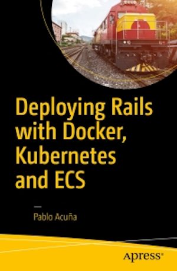

[](https://gitpitch.com/enogrob/ebook-project/master)
```
Roberto Nogueira  
BSd EE, MSd CE
Solution Integrator Experienced - Certified by Ericsson
```
# eBook Deployment Rails with Docker and Kubernetes



**About**

Learn everything you need to about the subject of this `eBook` project.

[Homepage](http://www.apress.com/la/book/9781484224144)

## Topics
```
[ ] Development
[ ] Setting Up Tools for Production
[ ] Kubernetes
[ ] Amazon EC2 Container Service
[ ] Continuous Integration
```
